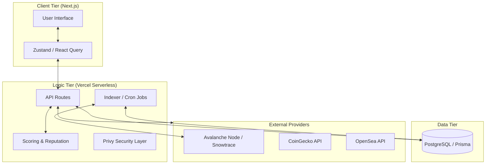
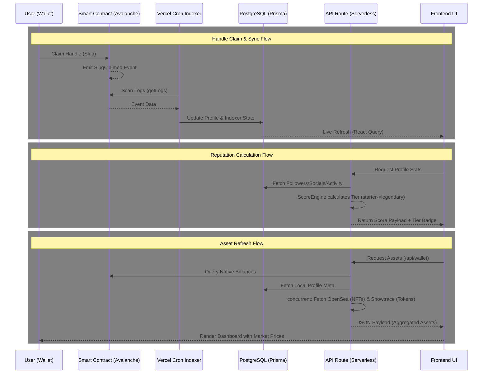

  <h1 style="font-family: 'Geist Mono', monospace; font-size: 3rem; font-weight: bold;">SOCI4L</h1>
  
  **Turn your Avalanche wallet into a measurable public identity.**

  

    <!--SOCI4L is an Avalanche-native public profile infrastructure built to unify EVM users. It transforms your EVM wallet address into a public, human-readable social profile.-->
    Turn your wallet into your SOCI4L profile. Showcase on-chain assets, add links, and share everything as one public page with full control and built-in insights.
  

  

    
    
  

## Our Story (Built for Avalanche)

SOCI4L was born out of pure passion during the **Avalanche Build Games**. What started as a simple idea quickly evolved into a comprehensive public identity infrastructure. Throughout this journey, we have built professional designs, complex architectural diagrams, functional indexing engines, and robust smart contracts that reached the Mainnet.

We want to express our deepest gratitude to everyone who believed in us, the Avalanche Build Games team for organizing this incredible initiative, and the entire Avalanche community for their endless support. This is just the beginning! 🔺

---

## 🔗 Related Repositories

Explore the different components that make up the SOCI4L ecosystem:

- **[SOCI4L Content Hub](https://github.com/SOCI4LNET/SOCI4L)**: The main repository containing the core platform built with Next.js, including the dashboard, profile builder, and API logic.
- **[SOCI4L Brand Assets](https://github.com/SOCI4LNET/SOCI4L-Brand-Assets)**: Official logos, badges, backgrounds, and brand guidelines.
- **[SOCI4L Web Extension (Fuji Testnet)](https://github.com/SOCI4LNET/SOCI4L-Web-Extension-Fuji)**: A dedicated build of our Chrome Extension pre-configured for the **Fuji Testnet** for evaluation.
- **[SOCI4L Web Extension (Mainnet)](https://github.com/SOCI4LNET/SOCI4L-Web-Extension)**: The official browser extension available on the Chrome Web Store, configured for the Avalanche C-Chain.
- **[SOCI4L SDK](https://github.com/SOCI4LNET/SOCI4L-SDK)**: (In Development) A toolkit for developers to integrate SOCI4L's identity and reputation features into their own Avalanche projects.

---

## ⚖️ Jury Evaluation Guide (Fuji Testnet)

To help the Avalanche Build Games judges review SOCI4L efficiently, we have prepared a step-by-step functionality walkthrough. 

**Important:** Our MVP heavily interacts with the blockchain. Please ensure your wallet is connected to the **Avalanche Fuji Testnet** and you are browsing the official testnet environment:

👉 **[testnet.soci4l.net](https://testnet.soci4l.net)**

> [!NOTE]
> **Before You Start: Known Self-Profile Limitations**
>
> SOCI4L is a **social platform**, so certain features are intentionally hidden when you're viewing your **own** profile. If you test exclusively with one wallet, you may notice the following. This is **by design, not a bug**:
>
> - 🚫 **Donate button is hidden on your own profile.** Even if you navigate to your profile with the `?action=donate` URL parameter, the donate modal will not open if you are on the same wallet. To test donations, visit *another* user's profile (e.g., [testnet.soci4l.net/p/xbrokkr](https://testnet.soci4l.net/p/xbrokkr)) using a different wallet.
> - 👁️ **Follow, Mute, and Block buttons are not shown on your own profile.** These social interaction buttons only appear when you visit *someone else's* profile.
> - 📊 **Your own profile views are not counted in Insights.** Self-visits are excluded from analytics to keep data meaningful.
>
> **Tip:** For the best testing experience, use two different wallets/accounts, one to explore your own dashboard, and the other to interact with your profile as a visitor would.

Here is the recommended path to experience the core mechanics of SOCI4L:

1. **Connect & Claim Your Profile:** Visit the testnet link above, connect your Web3 wallet, and claim your unique SOCI4L profile.
2. **Register a Custom Slug:** Navigate to your **Settings Panel** and register a permanent, on-chain custom slug (e.g., `soci4l.net/p/yourname`).
3. **Upgrade to PRO:** Test our on-chain Premium Subscription flow by clicking the "Upgrade to Pro" button or by navigating directly to the `/premium` page.
4. **Send an On-chain Donation:** Visit a different profile (for example, our product lead: [testnet.soci4l.net/p/xbrokkr](https://testnet.soci4l.net/p/xbrokkr)) and use the **Donate** button to send them some testnet AVAX.
5. **Manage Your Digital Space:** Go to the **Links Panel**, add some of your social links or personal websites, and reorder your cards in the **Builder Panel**.
6. **Dive into Analytics:** Review your performance from two angles: click the **Insights** button directly on individual cards in your **Links Panel**, or visit the global **Insights Panel** to analyze overall click-through rates and audience locations.
7. **Track Your Footprint:** Open the **Activity Panel** on your dashboard and click on any transaction card to view your detailed on-chain history.
8. **Verify Socials:** Link your X (Twitter) account to earn the Verified badge and boost your reputation score.
9. **Discover Your On-Chain Identity:** Check the **"Assets"** tab on your profile page. Notice how your wallet's Avalanche tokens and NFTs are instantly fetched via our OpenSea/Snowtrace API integrations to calculate your portfolio.
10. **Check Your SOCI4L Score & Tier:** Go to your public profile (e.g., [testnet.soci4l.net/p/xbrokkr](https://testnet.soci4l.net/p/xbrokkr)) and hover your mouse cursor over your profile picture. You will see your dynamic On-Chain Reputation Score, which increases as you verify accounts, receive donations, or add links.
11. **Explore the Public Profile (Shareability):** Once you're done building, click the **"View Public Profile"** button at the top of your dashboard. See how easily your clumsy wallet address transforms into a highly shareable, Web2-friendly social hub.
12. **Tweak Your Settings:** Navigate to the **Settings Panel** and explore the live configuration options: toggle your profile between **Public/Private**, enable or disable incoming **Donations**, and choose your personal **Donation Alert Visual** (Confetti 🎉, Heart ❤️, Star ⭐ or Fire 🔥) that plays when you receive a tip. *(Note: Full profile customization, including themes, background colors, and custom fonts, is planned and listed in our roadmap.)*
13. **Embed Your Profile Anywhere:** Go to any public profile, click the **three dots (⋮)** menu, and copy the **Embed Code**. Try pasting it into any external website! For a real-world example, check out our product lead's CV at [merickalkan.cv](https://merickalkan.cv), where people can tip him directly via the embedded SOCI4L widget without leaving his website.
14. **Scan & Share (QR Code):** On your public profile, click the **three dots (⋮)** menu again and select **QR Code**. You can download it or scan it directly. Imagine speaking at an Avalanche event: instead of spelling out multiple links, just put your SOCI4L QR code on your presentation slide and let people instantly access your entire digital identity and donation gateway!

### 🌐 Chrome Extension (Donate Anywhere)
We have developed a Chrome Extension that allows users to send AVAX donations directly via X (Twitter) profiles that have a verified SOCI4L link.

> **⚠️ NOTE FOR JUDGES:** The version currently published on the [Chrome Web Store](https://chromewebstore.google.com/detail/soci4l-donate/hpdblnjffdobbhohkjlniikdfkafagdk) is strictly configured for the **Avalanche Mainnet** (`soci4l.net`) and cannot be used with testnet funds.
> 
> **To test the extension with Fuji test funds:** Download the **Fuji Testnet build** directly from our dedicated repository: [SOCI4L-Web-Extension-Fuji](https://github.com/SOCI4LNET/SOCI4L-Web-Extension-Fuji). This build is pre-configured to point to `testnet.soci4l.net`. Load it in Developer Mode (`chrome://extensions` → Enable Developer Mode → Load unpacked) and test the cross-platform tipping feature on profiles like [x.com/0xBrokkr](https://x.com/0xBrokkr).

> **Done with the walkthrough?** After reviewing this showcase repository, we highly recommend exploring our other core repositories: our **[Chrome Extension (Fuji Testnet)](https://github.com/SOCI4LNET/SOCI4L-Web-Extension-Fuji)** to experience cross-platform tipping, and our **[Brand Assets](https://github.com/SOCI4LNET/SOCI4L-Brand-Assets)** repository (which includes our official Figma design link) to see our visual identity system.

---

## Problem Statement

Every wallet in the Web3 ecosystem is effectively anonymous. A 42-character hex address carries no human context: no name, no links, no reputation, no way to receive value directly. When a builder wants to share their work, they scatter links across Twitter bios, Linktree pages, and Notion docs. When a collector wants to showcase their NFTs, there is no canonical public page that belongs to them. When a creator wants to receive tips, they navigate through exchanges, bridge UIs, and manual address sharing.

The core problem is a missing identity layer. Web3 has wallets, but it does not have profiles. It has transactions, but it does not have context. It has value transfer capabilities, but reaching that functionality requires too many steps for both the sender and the recipient.

Existing solutions fall into two camps: centralized link-in-bio tools (Linktree, Beacons) that ignore on-chain data entirely, or fully on-chain protocols (ENS, Lens) that sacrifice UX to the point where mainstream adoption is unreachable. Neither camp answers the question: *"How do I turn my Avalanche wallet into something I can share with anyone and receive value from them directly?"*

SOCI4L is built to answer exactly that question.

## Solution

SOCI4L transforms every EVM wallet address into a structured, shareable, and monetizable public identity, without requiring users to understand the underlying blockchain infrastructure.

The architecture uses a deliberate **Hybrid Data Model**: social data (profile customization, link categories, analytics) lives off-chain in PostgreSQL for instant reads and zero gas cost, while ownership and value transfer (custom slugs, donations, premium subscriptions) are settled on-chain via Avalanche C-Chain smart contracts. This split is not a compromise. It is a rational design decision that gives users Web2-level responsiveness with Web3-level ownership guarantees.

Every profile mutation requires a cryptographic wallet signature validated server-side, meaning no unauthorized data can ever be written. Every payment, whether a donation or a premium subscription, settles directly on-chain with no intermediary, no commission delay, and no chargeback risk.

## Why Avalanche?

The choice of Avalanche C-Chain was not default or arbitrary. It was the conclusion of evaluating what SOCI4L's architecture actually requires from a network:

- **Sub-second Finality for Real UX:** SOCI4L's slug registration, donation flow, and premium payments are on-chain interactions that users trigger from a social product UI. On Ethereum mainnet, a user would wait 12-15 seconds per block confirmation, creating an unacceptable experience for a profile page. Avalanche's sub-second finality means the on-chain confirmation feels instant, comparable to a Web2 form submission. This is not a marginal improvement; it is the difference between a product that feels broken and one that feels native.

- **Low Gas Fees Enable Micro-interactions:** SOCI4L is designed for everyday social activity: claiming a slug, sending a small AVAX donation, purchasing a premium subscription. On high-fee networks, these micro-transactions become economically irrational. Avalanche's low and stable gas fees make the economics work for both the platform and its users, enabling the "tip culture" that is central to the SOCI4L value proposition.

- **EVM Compatibility with No Lock-in Friction:** Because Avalanche C-Chain is fully EVM-compatible, SOCI4L's smart contracts (CustomSlugRegistry, DonatePayment, PremiumPayment) are standard Solidity, auditable by any EVM developer, and usable with any EVM wallet, from Core Wallet to MetaMask to WalletConnect-compatible mobile wallets. There is no proprietary SDK, no custom RPC gymnastics, no bridging required.

- **Ecosystem Alignment:** Avalanche's community-first ethos, including grants, hackathons, builder incentives, and the Multiverse program, mirrors the values SOCI4L is built around: empowering builders, creators, and collectors to own their digital presence. SOCI4L is not just built *on* Avalanche; it is built *for* the Avalanche community.

## Architecture Overview

### System Overview
SOCI4L is a premium Web3 social profile hub and identity management platform designed for the Avalanche ecosystem. It empowers users to claim unique, human-readable handles (slugs), aggregate their digital assets (NFTs and tokens), and customize their social presence. The system bridges the gap between decentralized blockchain data and high-performance social networking by employing an event-driven synchronization layer and a robust reputation scoring system.

### Technology Stack
- **Frontend**: Next.js 16 (App Router), React 19, Tailwind CSS, Radix UI, Framer Motion, Lenis Scroll.
- **Backend/API**: Next.js Serverless Functions (Node.js/TypeScript).
- **Database Logic**: Prisma ORM with PostgreSQL.
- **Blockchain Connectivity**: 
  - **Framework**: Viem & Wagmi.
  - **Network**: Avalanche C-Chain / Avalanche Fuji.
- **Authentication/Identity**: Privy (Social Verification).
- **External Data**: 
  - **Pricing/Market**: CoinGecko API.
  - **Metadata/NFTs**: OpenSea API & Snowtrace.

### Core Components
#### 1. Dynamic Layout Engine
A row-based customization system that allows users to reorder components (Links, Activity, Assets) while ensuring design consistency through automated normalization and grid-packing algorithms.

#### 2. Reputation & Engagement Scoring
A proprietary scoring engine (`lib/score.ts`) that calculates a user's "SOCI4L Score". It employs a **tiered diminishing returns** algorithm to prevent score inflation from bot-ran followers while rewarding verified social identities (Sybil resistance) and meaningful platform activity (donations).

#### 3. Event-Driven Indexing Engine
The `SlugRegistryIndexer` (Cron) mirrors on-chain state into the database. It utilizes a "Self-Healing" state machine with atomic event processing to ensure the PostgreSQL layer is always consistent with the Avalanche C-Chain.

### High-Level Architecture Diagram

### Data Flow

### Signature & Contract Maps

```mermaid
flowchart TD
    subgraph Architecture Key
        L1["**Blue: Frontend**<br/>UI Pages & Interactions"]:::frontend ~~~ L2["**Green: Off-chain**<br/>Database & API Signatures"]:::offchain ~~~ L3["**Orange: On-chain**<br/>Smart Contract TXs"]:::onchain ~~~ L4["**Purple: Upcoming**<br/>Future Roadmap Features"]:::roadmap
    end

    classDef default fill:#333,stroke:#666,color:#fff
    classDef frontend fill:#3b82f6,stroke:#1d4ed8,color:#fff
    classDef offchain fill:#10b981,stroke:#047857,color:#fff
    classDef onchain fill:#f59e0b,stroke:#b45309,color:#fff
    classDef roadmap fill:#8b5cf6,stroke:#5b21b6,color:#fff

    BuilderPanel["Builder<br/>/dashboard/[address]"]:::frontend
    LinksPanel["Links<br/>/dashboard/[address]/links"]:::frontend
    SettingsPanel["Settings<br/>/dashboard/[address]/settings"]:::frontend
    ClaimButton["Claim Button<br/>Public Pages"]:::frontend
    SlugManager["Slug Manager<br/>/dashboard/[address]"]:::frontend
    FollowToggle["Follow Toggle<br/>Profile Page"]:::frontend
    SocialLinkPage["Social Link<br/>/dashboard/links/[linkId]"]:::frontend
    DonateModal["Donate Modal<br/>/donate-modal"]:::frontend
    PremiumModal["Premium Upgrade<br/>/premium"]:::frontend
    DocsAdminLogin["Admin Login<br/>/docs-admin/login"]:::frontend

    UpdateAppearance["updateAppearance<br/>/api/profile/appearance"]:::offchain
    UpdateLayout["updateLayout<br/>/api/profile/layout"]:::offchain
    UpdateProfile["updateProfile<br/>/api/profile/update"]:::offchain
    SaveAll["saveAll<br/>/api/profile/save-all"]:::offchain
    
    AddLink["addLink<br/>/api/profile/links"]:::offchain
    UpdateSocialLinks["updateSocialLinks<br/>/api/profile/social"]:::offchain
    UpdateLink["updateLink<br/>/api/profile/links"]:::offchain
    DeleteLink["deleteLink<br/>/api/profile/links"]:::offchain

    UpdateVisibility["updateVisibility<br/>/api/profile/visibility"]:::offchain
    UpdateCategories["updateCategories<br/>/api/profile/categories"]:::offchain
    UpdateAppearance2["updateAppearance<br/>/api/profile/appearance"]:::offchain

    ClaimProfile["claimProfile<br/>/api/profile/claim"]:::offchain
    
    SyncSlug["syncSlug<br/>/api/slug/sync"]:::offchain
    RegisterSlug["registerSlug<br/>CustomSlugRegistry"]:::onchain

    Authenticate["authenticate<br/>/api/auth/verify"]:::offchain
    LinkSocial["linkSocialAccount<br/>/api/social/link"]:::offchain

    Donate["donate<br/>DonatePayment Contract"]:::onchain

    PurchasePremium["purchasePremium<br/>PremiumPayment Contract"]:::onchain
    SyncPremium["syncPremium<br/>/api/premium/sync"]:::offchain

    AdminAuth["adminAuth<br/>/docs-admin/auth"]:::offchain

    %% Upcoming Features (Roadmap)
    PostFeed["Post Feed & Signed Posts"]:::roadmap
    CommentSystem["Comment System"]:::roadmap
    BountyBoard["Bounty & Job Board"]:::roadmap
    ReferenceSystem["On-chain Reference System"]:::roadmap
    PinnedAnnouncements["Pinned Announcements"]:::roadmap
    PollVoting["On-chain Poll & Voting"]:::roadmap
    GatedContent["Gated Content"]:::roadmap
    PremiumThemes["Premium Themes"]:::roadmap
    AIAgents["Universal AI Agent ID"]:::roadmap

    BuilderPanel --> UpdateAppearance
    BuilderPanel --> UpdateLayout
    BuilderPanel --> UpdateProfile
    BuilderPanel --> SaveAll

    LinksPanel --> AddLink
    AddLink --> UpdateSocialLinks
    LinksPanel --> UpdateLink
    UpdateLink --> DeleteLink

    SettingsPanel --> UpdateVisibility
    SettingsPanel --> UpdateCategories
    UpdateVisibility --> UpdateAppearance2
    UpdateCategories --> UpdateAppearance2

    ClaimButton --> ClaimProfile

    SlugManager --> SyncSlug
    SlugManager --> RegisterSlug

    FollowToggle --> Authenticate
    SocialLinkPage --> LinkSocial

    DonateModal --> Donate

    PremiumModal --> PurchasePremium
    PremiumModal --> SyncPremium

    DocsAdminLogin --> AdminAuth

    %% Roadmap Flow Links
    BuilderPanel -.-> PremiumThemes
    BuilderPanel -.-> PinnedAnnouncements
    BuilderPanel -.-> GatedContent
    BuilderPanel -.-> ReferenceSystem
    
    SocialLinkPage -.-> PostFeed
    
    %% Public Profile interactions
    ClaimButton -.-> AIAgents
    FollowToggle -.-> PollVoting
    FollowToggle -.-> CommentSystem
    
    SlugManager -.-> BountyBoard
```

### Scalability & Reliability
- **Economic Scalability**: The reputation system's diminishing returns model prevents "whale inflation," ensuring the platform's social hierarchy remains meaningful as the user base grows.
- **Fail-Safe Asset Discovery**: The dual-source NFT logic (OpenSea + Snowtrace) ensures that even during API outages of a primary provider, users can still view their basic on-chain balances.
- **Performance Optimization**: Aggressive batching of CoinGecko prices and edge-caching of API responses minimize cold-start latency and protect against external rate limits.

### Security Considerations
- **Sybil Resistance**: Integration of OAuth-based social verification via Privy allows the system to distinguish between genuine users and automated accounts.
- **Atomic Operations**: All indexing and scoring updates are handled within Prisma transactions to prevent race conditions during concurrent chain events.
- **JWT-Based Sessions**: Secure, signed session tokens stored in HttpOnly/Secure cookies protect user identity and administrative access.

## Roadmap

### Foundation & Data (DONE)
Core identity layer, analytics and admin infrastructure shipped.
<ul>
<li>

  
  
Gasless Profile Engine & Identity Resolution
    
  
    
    
<i>Instant, cost-free profile creation and updates: wallet ownership is verified via a cryptographic off-chain signature, no gas required, no on-chain transaction needed for profile setup.</i>

  
    

</li>

<li>

  
  
Donate V1
    
  
    
    
<i>Accept tips directly on your public profile, via our Web Extension, or by adding the SOCI4L Donate Embed to your own website.</i>

  
    

</li>

<li>Personalized Link Hub & Asset Showcase</li> 
<li>Admin Panel & User Management</li> 
<li>Server-side Analytics (verified views)</li> 
<li style="list-style: ">

  
  
OpenSea NFT Integration
    
  
    
    
<i>Accept tips directly on your public profile, via our Web Extension, or by adding the SOCI4L Donate Embed to your own website.</i>

  
    

</li>
</ul>

### Growth & Economy (NOW)
On-chain signed interactions that generate transactions and grow the ecosystem.
<ul>
<li>

  
  
Post Feed & On-chain Signed Posts
    
  
    
    
<i>Share updates using EIP-712 signatures, ensuring your thoughts are cryptographically tied to your wallet identity.</i>

  
    

</li>
<li>Comment System</li> 
<li>

  
  
Bounty & Job Board
    
  
    
    
<i>Find or post tasks for the community with automated smart-contract based reward distribution.</i>

  
    

</li>
<li>On-chain Reference System</li> 
<li>Pinned Announcements</li> 
<li>

   
  
On-chain Poll & Voting
    
  
    
    
<i>Participate in transparent, tamper-proof community polls where outcomes are recorded and verified on the blockchain.</i>

  
    

</li>
<li>

  
  
Gated Content
    
  
    
    
<i>Lock specific content or files behind NFT ownership or minimum token balance requirements.</i>

  
    

</li>
<li>Profile Customization & Premium Themes</li> 
<li>

  
  
Universal AI Agent Identities
    
  
    
    
<i>An open identity layer where AI agents from any project or ecosystem can have a verified SOCI4L profile, own assets, and interact with the social economy autonomously.</i>

  
    

</li>
</ul>

### Protocol Layer (LATER)
Moving social graph and reputation on-chain.
<ul>
<li>

  
  
On-chain Social Graph (Portability)
    
  
    
    
<i>Fully portable decentralized social network where you own your connections and data across the ecosystem.</i>

  
    

</li>
<li>

  
  
Portable Reputation (Attestations)
    
  
    
    
<i>Reputation system built on social interactions and on-chain activities that travels with your wallet and profile across the ecosystem.</i>

  
    

</li>
<li>

  
  
Portable Reputation (Attestations)
    
  
    
    
<i>Reputation system built on social interactions and on-chain activities that travels with your wallet and profile across the ecosystem.</i>

  
    

</li>
<li>

  
  
Team & DAO Profile Pages
    
  
    
    
<i>Official organizational profiles for DAOs, developer teams, and university student clubs/societies.</i>

  
    

</li>
<li>

  
  
Developer API
    
  
    
    
<i>Open API and SDK for developers to build applications and integrations on top of the SOCI4L protocol layer.</i>

  
    

</li>
</ul>

## Live Contracts (✅ Source Verified)
All SOCI4L smart contracts are deployed and their source codes are fully verified on Snowtrace. Judges can read the source codes, verify ABIs, and interact with the contracts directly via the explorer links below.

### Avalanche C-Chain (Mainnet)
- **CustomSlugRegistry:** [`0xC894a2677C7E619E9692E3bF4AFF58bE53173aA1`](https://snowtrace.io/address/0xC894a2677C7E619E9692E3bF4AFF58bE53173aA1#code)
- **PremiumPayment:** [`0x9bA02537447E6DcdeF72D0e98a4C82E6B73E3cCC`](https://snowtrace.io/address/0x9bA02537447E6DcdeF72D0e98a4C82E6B73E3cCC#code)
- **DonatePayment:** [`0x863deaF39D816fBA5D10E3e846a2D953Aa9aEca5`](https://snowtrace.io/address/0x863deaF39D816fBA5D10E3e846a2D953Aa9aEca5#code)

### Avalanche Fuji (Testnet)
- **CustomSlugRegistry:** [`0xd8c1C36c6d68858AC8c6AFD7f4AdB654Fef8630A`](https://testnet.snowtrace.io/address/0xd8c1C36c6d68858AC8c6AFD7f4AdB654Fef8630A#code)
- **PremiumPayment:** [`0x63c4cBe555aFae0DA3C86f868F0BA496d74c988E`](https://testnet.snowtrace.io/address/0x63c4cBe555aFae0DA3C86f868F0BA496d74c988E#code)
- **DonatePayment:** [`0xE4303a02F8246CCf64190AE5d48089534290C7Ab`](https://testnet.snowtrace.io/address/0xE4303a02F8246CCf64190AE5d48089534290C7Ab#code)

## Impact on Avalanche Ecosystem

### Network Usage Impact
We believe that SOCI4L will see accelerated growth in usage due to its infrastructure being suitable for everyday use. We anticipate that this growth will proportionally increase transaction volume on Avalanche and boost the number of active users.

### Developer Ecosystem Impact
As the SOCI4L team, we haven't forgotten our developer community. We will provide them with SDK and API support so they can integrate SOCI4L into their own projects. Additionally, we will encourage the development of projects with SOCI4L integration in later stages. Along with all this, we anticipate an increase in Avalanche-based developments.

### User Retention & Stickiness
SOCI4L has a scoring system that can retain users on the platform, job and reward listings, a system for sharing posts and comments, events, and many other features. We anticipate that users will maintain their loyalty to the platform once they gain something from these features.

## Team

## Demo & Links
[SOCI4L on X](https://x.com/)

[SOCI4L.net Live (On Testnet)](https://testnet.soci4l.net/) 
[SOCI4L.net Live](https://soci4l.net/) 
[SOCI4L.net Demo](https://soci4l.net/demo) 
[SOCI4L.net Demo Investor Playground](https://soci4l.net/demo/investor) 
